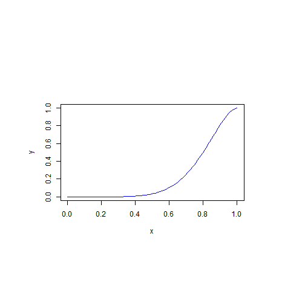

## Introduction 

(source - wikipedia.org)

In probability theory and statistics, the beta distribution is a family of continuous probability distributions defined on the interval [0, 1] parametrized by two positive shape parameters, denoted by alpha and beta, that appear as exponents of the random variable and control the shape of the distribution.

The beta distribution has been applied to model the behavior of random variables limited to intervals of finite length in a wide variety of disciplines.

Examples of Application - 
* Allele frequencies in population genetics
* Healthcare - insurance coverage distributions

---
## Distribution and parameters


$$\begin{equation}
Beta(\alpha,\beta):\,\, prob(x|\alpha,\beta)=\frac{x^{\alpha-1}(1-x)^{\beta-1}}{B(\alpha,\beta)}\label{eq:BetaDensity}
\end{equation}$$

* B - normalization constant
* alpha and beta are > 0 shape parameters
* x in the above equation is a realization - an observed value that actually occurred - of a random process X


---
## Sample R code - illustrating beta distribution

```r
x=seq(0,1,length=100)
y=pbeta(x,7,2,ncp=0,lower.tail = TRUE)
par(mfrow=c(1,1), mar=c(12,7,12,7)) 
plot(x,y, type="l", col="blue")
```

 


---
## References

https://en.wikipedia.org/wiki/Beta_distribution


